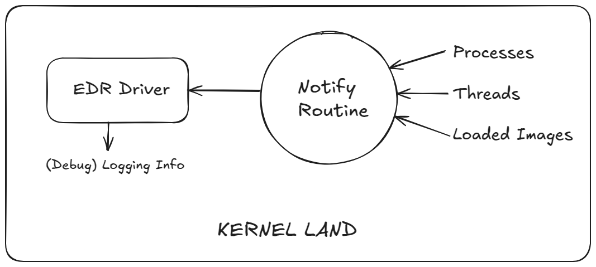

# Phase 1 - Monitor usage of Image, Process, Thread

## Planning



## Notes

A initial base layout for EDR driver which monitors the process and thread creation in the operating system. This can be attained easily by creating and using callbacks in kernel-mode.

The below mentioned routines are used to monitor the above said activity

https://learn.microsoft.com/en-us/windows-hardware/drivers/ddi/ntddk/nc-ntddk-pload_image_notify_routine

```c
NTSTATUS PsSetLoadImageNotifyRoutine(
  [in] PLOAD_IMAGE_NOTIFY_ROUTINE NotifyRoutine
);

PLOAD_IMAGE_NOTIFY_ROUTINE PloadImageNotifyRoutine;

void PloadImageNotifyRoutine(
  [in, optional] PUNICODE_STRING FullImageName,
  [in]           HANDLE ProcessId,
  [in]           PIMAGE_INFO ImageInfo
);
```

https://learn.microsoft.com/en-us/windows-hardware/drivers/ddi/ntddk/nc-ntddk-pcreate_thread_notify_routine

```c
NTSTATUS PsSetCreateThreadNotifyRoutine(
  [in] PCREATE_THREAD_NOTIFY_ROUTINE NotifyRoutine
);

PCREATE_THREAD_NOTIFY_ROUTINE PcreateThreadNotifyRoutine;

void PcreateThreadNotifyRoutine(
  [in] HANDLE ProcessId,
  [in] HANDLE ThreadId,
  [in] BOOLEAN Create
);
```

https://learn.microsoft.com/en-us/windows-hardware/drivers/ddi/ntddk/nc-ntddk-pcreate_process_notify_routine

```c
NTSTATUS PsSetCreateProcessNotifyRoutine(
  [in] PCREATE_PROCESS_NOTIFY_ROUTINE NotifyRoutine,
  [in] BOOLEAN                        Remove
);

PCREATE_PROCESS_NOTIFY_ROUTINE PcreateProcessNotifyRoutine;

void PcreateProcessNotifyRoutine(
  [in] HANDLE ParentId,
  [in] HANDLE ProcessId,
  [in] BOOLEAN Create
);
```

## Proof Of Concept

You can watch the video PoC by clicking [here](./poc.mp4).
