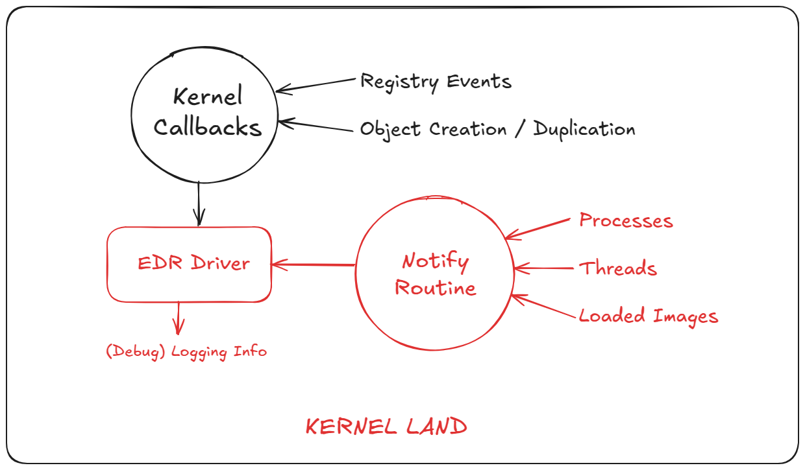

# Phase 2 - Monitor Registry Events and Object Events

## Planning



## Notes

Continuing the [Phase1](../Phase1/) layout, I have implemented kernel callbacks for registry events and object events. Registry events are processed via `CmRegisterCallbackEx` and object events are processed via `ObRegisterCallbacks`  

The structure for the Callbacks are given below

https://learn.microsoft.com/en-us/windows-hardware/drivers/ddi/wdm/nf-wdm-cmregistercallbackex

```c
NTSTATUS CmRegisterCallbackEx(
  [in]           PEX_CALLBACK_FUNCTION Function,
  [in]           PCUNICODE_STRING      Altitude,
  [in]           PVOID                 Driver,
  [in, optional] PVOID                 Context,
  [out]          PLARGE_INTEGER        Cookie,
                 PVOID                 Reserved
);
```

https://learn.microsoft.com/en-us/windows-hardware/drivers/ddi/wdm/nf-wdm-obregistercallbacks

```c
NTSTATUS ObRegisterCallbacks(
  [in]  POB_CALLBACK_REGISTRATION CallbackRegistration,
  [out] PVOID                     *RegistrationHandle
);
```

The above mentioned callbacks will trigger their respective callback function to process the data received from kernel land.

Set a unique altitude value which do not clash with other drivers. Refer the below link for more.

https://learn.microsoft.com/en-us/windows-hardware/drivers/ifs/allocated-altitudes

While registering object callbacks you might come across `0xC0000022 (ACCESS_DENIED)` during development. This is due to the kernel checking the driver's signature and integrity check. To fix it, kindly enable `/INTEGRITYCHECK` linker option in your project's configuration properties.


Reference : https://community.osr.com/t/obregistercallbacks-returning-access-denied/52198/3


## Proof Of Concept

You can watch the video PoC by clicking [here](./poc.mp4).
